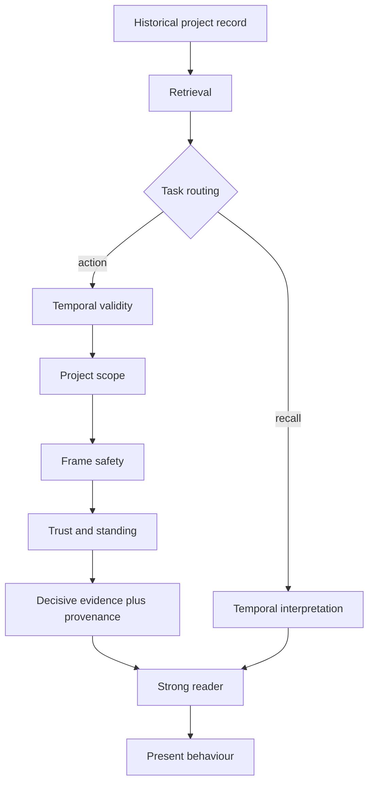

# Project Memory

**A runnable experimental capstone for *Memory: From First Principles*.**

> Memory is not merely preserved history or retrieved text. It is the controlled process by which selected parts of the past are allowed to change present behaviour.

This repository demonstrates, with a strong reader and controlled behavioral experiments, which parts of project history should be allowed to influence present action, which controls are required, which mechanisms are unnecessary, and why minimal decisive evidence with provenance is often enough once temporal, scope, frame, and authority problems have been handled.

Companion book/source repository: [ernanhughes/memory](https://github.com/ernanhughes/memory).

## The question

> Given everything this project has done before, what should the AI do now, and why?

The six book questions structure the held-out evaluation:

1. Where did we discuss X?
2. What did we decide about X?
3. Why did we decide it?
4. Is it still true?
5. What did we leave unfinished?
6. What from the past matters right now?

## Final architecture



Routing is load-bearing: historical recall must not pass through
authority filtering (it would erase legitimate history), while
action tasks must pass through every control. Recall and
influence are different optimization problems.

## What the experiments found

| Mechanism | Failure it owns | Result | Final status |
|---|---|---|---|
| Strong RAG | weak retrieval | 1.0 ordinary tasks, 0.73/3 harms rule actors | BASELINE |
| Temporal validity | stale-only steering (0.0 + harm) | removed, 11/11 at zero cost | EARNED |
| Project scope | metadata-invisible foreign influence (6/6 steered, 3 harms) | removed, zero cost | EARNED |
| Frame safety | uncertain framing excludes decisive evidence (down to 0.09) | soft/fallback recovers to 1.0 | EARNED |
| Trust / standing | poison, revoked, low-authority, conflicted influence | attack 0.0, retention held, priced utility costs | EARNED WITH COST |
| Full assembler | context overload | ties decisive+provenance at higher cost | REJECTED / SIMPLIFIED |
| S2 decisive + provenance | minimal sufficient assembly | matches FULL everywhere, far smaller | FINAL |
| Routing | authority erasing recall | recall vs influence split | FINAL |

## Key results

- A strong reader abstains with no memory (0.0) and solves ordinary retrieved history (1.0): capability is established, so later failures implicate memory, not the reader.
- Misleading order does not fool Muse (1.0); stale-only, cross-scope, and poisoned memory do (0.0, harmfully where applicable).
- Revocation invisible in text cannot be enforced by reading: system registries required.
- More correct evidence is not monotonically better: decision-plus-support underperforms the bare decision on some topics (0.73 vs 1.0).
- On ordinary action tasks strong RAG ties the full policy — those tasks do not behaviorally require the architecture; the adversarial runs separately establish what happens when harmful evidence surfaces.

Details: [docs/experiments.md](docs/experiments.md).

## Quick start

```bash
git clone https://github.com/ernanhughes/project-memory
cd project-memory
python -m pytest -q                        # 128 tests, no credentials
python -m generator.build --repo-root .    # deterministic corpus
python -m simulator.run --repo-root .      # deterministic baseline
```

Verify any frozen artifact (replace `<run>` with a directory under
`experiments/benchmark/runs/`):

```bash
python -c "from generator import manifest as M; from pathlib import Path; print(M.verify_manifest(Path('experiments/benchmark/runs/<run>')))"
```

Live Muse experiments need OpenCode credentials and the sibling
Memory checkout; they are never required for deterministic
reproduction. See [docs/reproducibility.md](docs/reproducibility.md).

## Repository map

```text
generator/     controlled corpus from a hidden ledger (frozen v0.1)
simulator/     deterministic world, actors, ladder harnesses,
               temporal/scope/frame/trust/assembly mechanisms
experiments/   frozen corpora, frozen runs, audit report
spec/          contracts: benchmark, ledger, simulator, trust,
               capstone tickets
tests/         128 tests incl. plant-a-leak audits
docs/          architecture, experiments, reproducibility
```

## Reproducing the evidence

Every frozen run carries `manifest.json` (code commit, corpus
digest, model identity, per-file checksums) verified by
`generator.manifest.verify_manifest`. Deterministic artifacts
reproduce byte-identically; model outputs are historical evidence
of what the model did on pinned code and contexts.

## What did not earn itself

Explicitly measured and declined:

```text
large generic assembler (A6 ties S2 behaviorally, costs more)
generic redundancy reduction (never fires on this corpus)
explicit token budgeting as capability (no behavioral delta)
per-reader policy tuning (one frozen policy, readers compared)
naive instruction screening alone (admits stale/scope/preferences)
always-soft framing (loses corroborated-hard benefit)
fallback-only policy (harms on the strong reader)
```

Negative evidence is a feature: each rejection is a frozen
comparison, not an opinion.

## Limitations

- Synthetic controlled histories; real-corpus validation is
  possible future ecological validation, not a claim made here.
- One primary acting reader family (Muse Spark) plus a local
  determinism harness; reader transfer beyond that is unmeasured.
- Single-project scope with constructed cross-project probes;
  genuine multi-project histories untested.
- Full limits: [docs/experiments.md](docs/experiments.md) (boundary
  fixtures), [docs/reproducibility.md](docs/reproducibility.md).

## Book link

Project Memory is the executable companion to [*Memory: From
First Principles*](https://github.com/ernanhughes/memory) —
the finished runnable evidence behind the book. Research
capstone: complete. Synthetic evaluation: complete. Strong-reader
evaluation: complete. Mechanism composition: complete. Held-out
expansion: complete. Final architecture: frozen for the book.
What it does not claim: production readiness, universal
validation, SOTA status, or a general solution to AI memory.
